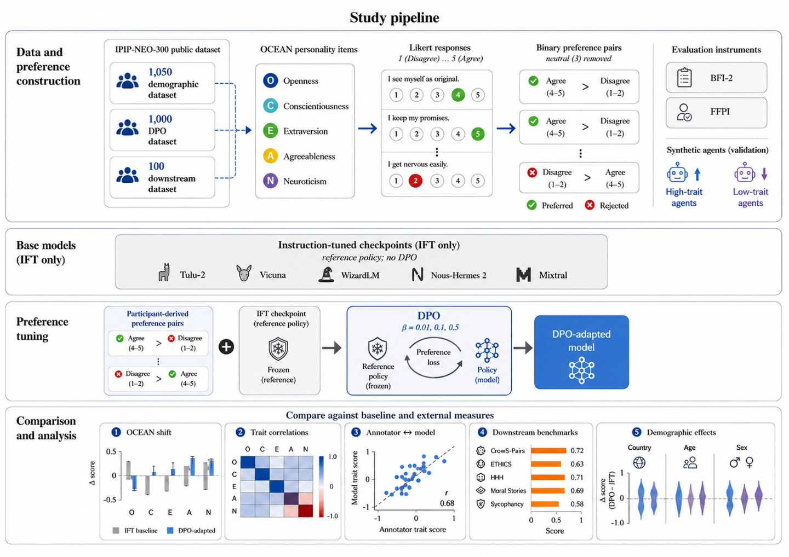
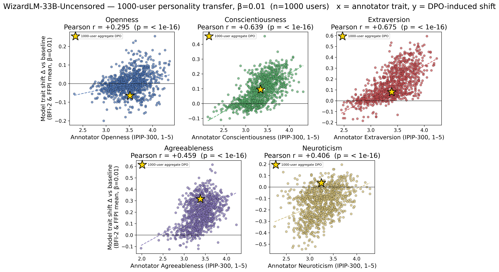
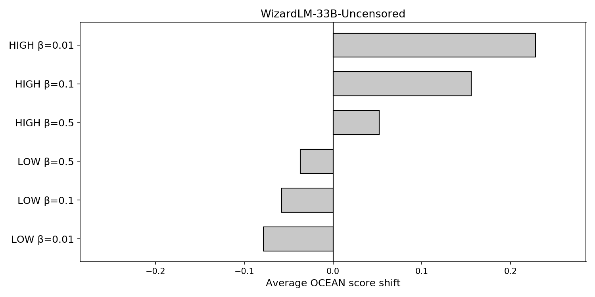

# OCEAN — Does Preference Tuning Make Models Inherit the Annotator's Personality?

Preference data is usually treated as a neutral signal of "better vs. worse" answers.
But every preference pair is chosen by a person, and people choose according to who
they are. This project shows that Direct Preference Optimization (DPO) transfers more
than answer quality: models absorb the **personality** of the person who labeled the
preferences, measured on the Big Five (OCEAN) traits — Openness, Conscientiousness,
Extraversion, Agreeableness, Neuroticism.



The pipeline: annotators (synthetic extreme agents, or real people from an IPIP-300
response pool) answer forced-choice A/B scenarios. A base model is DPO-trained on those
choices with a small LoRA adapter. The trained model then takes held-out personality
questionnaires (BFI-2, FFPI, Goldberg-100), and we check whether its scores moved
toward the annotator's own personality.

## Key result: 1000 real annotators, five models

For each of 1000 annotators we trained one personalized DPO adapter (beta 0.01) and
measured the correlation between the annotator's trait score and the model's trait
shift. Pearson r, n = 1000:

| Trait | WizardLM-13B | WizardLM-33B | Vicuna-13B | Tulu-2-7B | Hermes-Mixtral |
|---|---|---|---|---|---|
| Openness          | +0.55 | +0.29 | +0.56 | +0.32 | −0.25 |
| Conscientiousness | +0.68 | +0.64 | +0.68 | +0.63 | −0.24 |
| Extraversion      | +0.62 | +0.67 | +0.65 | +0.60 | +0.12 |
| Agreeableness     | +0.59 | +0.46 | +0.55 | +0.38 | −0.37 |
| Neuroticism       | +0.05 | +0.41 | +0.38 | +0.19 | +0.51 |

Models in the 7B–33B range absorb the annotator's personality broadly across all five
traits. The larger Mixtral model inverts three traits (a ceiling effect: its baseline
scores are already near the top of the scale) and mainly absorbs Neuroticism.



Each dot is one annotator; the gold star is a single model trained on all 1000
annotators pooled. The synthetic-agent version of the experiment gives the same
picture: an agent that answers "high" on every trait pushes the model up, a "low"
agent pushes it down, and the effect is strongest at the weakest KL leash:



Personality shifts also carry over to behavior: trait shifts predict sycophancy and
moral-judgment changes on downstream benchmarks
(`results/downstream_trait_correlations_100users_model_average.csv`).

## Repository layout

```
OCEAN/
├── assets/                    figures used in this README
├── data/
│   ├── questionnaires/        BFI-2, FFPI, Goldberg-100, IPIP-300 items + scoring keys
│   ├── annotators/            IPIP-300 response pools and the 1000 sampled annotator ids
│   └── dpo/                   preference pairs: agents, per-trait, per-user, pooled-1000
├── pipeline/
│   ├── 01_baselines/          questionnaire runners for base models and APIs
│   ├── 02_build_data/         build preference pairs from annotator responses
│   ├── 03_train/              DPO training (single-GPU 4-bit + LoRA, and multi-GPU DDP)
│   ├── 04_eval/               questionnaire evaluation of trained adapters
│   ├── 05_sweeps/             orchestrators: multi-GPU grids, daemons, remote-box helpers
│   ├── 06_downstream/         benchmark battery (sycophancy, ethics, HHH, MMLU, ...)
│   ├── 07_interp/             mechanistic probes: sparse autoencoders, steering, LoRA deltas
│   └── 08_plots/              every figure in the project is regenerated from here
├── results/                   headline summary tables (correlations, t-tests)
├── requirements.txt
└── LICENSE
```

Folders are numbered in pipeline order; run everything from the repository root.

## Setup

```bash
pip install -r requirements.txt
```

Training and evaluation assume a Linux box with one or more 48GB GPUs and `nvidia-smi`.
Models download from Hugging Face on first use; set `HF_HOME` if you want them on a
specific disk.

## Running the pipeline end to end

**1. Baseline personalities.** Have a base model take a questionnaire (5 seeds, fresh
stateless prompts, 95% confidence intervals):

```bash
python3 pipeline/01_baselines/run_local_ocean.py
python3 pipeline/01_baselines/run_gpt_ocean.py        # GPT-4o via the OpenAI API
```

**2. Build preference data.** Synthetic extreme agents, per-trait agents, and real
annotators sampled from the 10,000-person IPIP-300 pool:

```bash
python3 pipeline/02_build_data/build_pool_10000.py
python3 pipeline/02_build_data/sample_users.py
python3 pipeline/02_build_data/build_user_dpo.py      # one jsonl per annotator
python3 pipeline/02_build_data/build_dpo_all_1000.py  # pooled 25,000-pair set
python3 pipeline/02_build_data/build_trait_dpo.py     # single-trait agents
```

**3. Train.** One DPO fine-tune = one model, one preference file, one beta:

```bash
python3 pipeline/03_train/dpo_train.py lmsys/vicuna-13b-v1.5 data/dpo/user_dpo/dpo_user_21330.jsonl 0.01 out_adapter

# multi-GPU version for the big pooled runs
torchrun --nproc_per_node=4 pipeline/03_train/dpo_train_ddp.py <model> data/dpo/user_dpo_all_1000.jsonl 0.01 <out>
```

**4. Evaluate.** The trained adapter takes BFI-2 and FFPI (IPIP items are excluded
because they built the training data):

```bash
python3 pipeline/04_eval/eval_adapter.py lmsys/vicuna-13b-v1.5 out_adapter results.json
```

**5. Sweeps.** The `master_*.py` scripts run full grids (models × annotators × betas),
spread jobs over free GPUs, and resume from finished work — for example the
1000-annotator sweep:

```bash
python3 pipeline/05_sweeps/master_users_1000.py
```

**6. Downstream behavior.** Benchmark battery (sycophancy, five ETHICS splits,
HHH alignment, moral stories, CrowS-Pairs, MMLU, HellaSwag, BoolQ) on trained
variants, via a patched lm-eval with the custom tasks in
`pipeline/06_downstream/custom_tasks/`:

```bash
python3 pipeline/06_downstream/downstream_full.py
python3 pipeline/06_downstream/downstream_aggregate.py
```

**7. Mechanistic probes (optional).** Sparse-autoencoder features, activation
steering, and LoRA weight-delta analysis of what the personality shift looks like
inside the model: `pipeline/07_interp/`.

**8. Figures.** Every plot regenerates from `pipeline/08_plots/`:

```bash
# the 1000-annotator scatter + correlation table (per model)
SWEEP_SHORT=WizardLM-33B-Uncensored SWEEP_FAMILY=WizardLM USERS_FILE=data/annotators/user_ids_1000.json \
  python3 pipeline/08_plots/user_corr_plots_1000.py

python3 pipeline/08_plots/wiz_agent_plots.py            # agent HIGH/LOW panels
python3 pipeline/08_plots/downstream_trait_scatter_model_average.py
python3 pipeline/08_plots/build_g_plots_viewer.py       # one-page interactive viewer of all plots
```

Evaluation writes `results_<model>_<variant>_beta<b>.json` files; the plot scripts
read those from the working directory, so run each phase from the repository root.

## Data files

- `data/questionnaires/` — four inventories as plain CSV with matching
  `*_scoring_key.csv` for reverse-coding to 1–5 OCEAN scores.
- `data/annotators/ipip300_responses_and_scores_10000.csv` — the response pool the
  1000 annotators are sampled from (`user_ids_1000.json`).
- `data/dpo/user_dpo/` — one preference file per annotator (25 A/B pairs each).
- `data/dpo/user_dpo_all_1000.jsonl` — all 1000 annotators pooled (25,000 pairs).
- `results/users1000_transfer_correlations_<model>.csv` — the headline table above.

## Models tested

Supervised-fine-tuned-only checkpoints (no preference training of their own), so any
personality shift comes from our DPO step: Tulu-2 (7B/13B), Vicuna v1.5 (7B/13B),
WizardLM (7B, 13B-V1.2, 33B-Uncensored), OLMo-7B-SFT, and
Nous-Hermes-2-Mixtral-8x7B-SFT. GPT-4o and Qwen2-57B serve as baseline test-takers.

## License

MIT — see [LICENSE](LICENSE).
